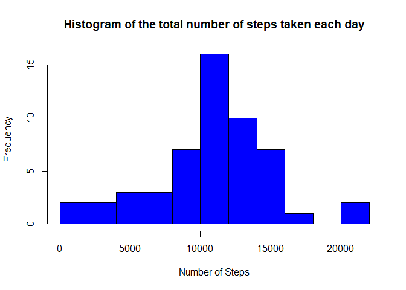
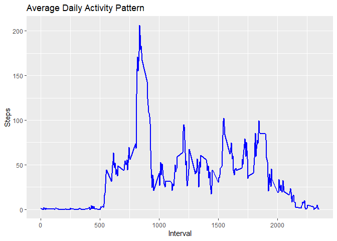
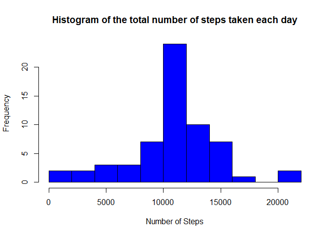
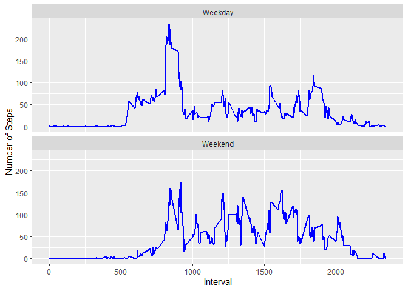

Introduction
------------

It is now possible to collect a large amount of data about personal
movement using activity monitoring devices such as a Fitbit, Nike
Fuelband, or Jawbone Up. These type of devices are part of the
“quantified self” movement - a group of enthusiasts who take
measurements about themselves regularly to improve their health, to find
patterns in their behavior, or because they are tech geeks. But these
data remain under-utilized both because the raw data are hard to obtain
and there is a lack of statistical methods and software for processing
and interpreting the data.

This assignment makes use of data from a personal activity monitoring
device. This device collects data at 5 minute intervals through out the
day. The data consists of two months of data from an anonymous
individual collected during the months of October and November, 2012 and
include the number of steps taken in 5 minute intervals each day.

The data for this assignment can be downloaded from the course web site:

Dataset: Activity monitoring data
(<a href="https://d396qusza40orc.cloudfront.net/repdata%2Fdata%2Factivity.zip" class="uri">https://d396qusza40orc.cloudfront.net/repdata%2Fdata%2Factivity.zip</a>)

The variables included in this dataset are:
-------------------------------------------

steps: Number of steps taking in a 5-minute interval (missing values are
coded as - NA)

date: The date on which the measurement was taken in YYYY-MM-DD format

interval: Identifier for the 5-minute interval in which measurement was
taken

The dataset is stored in a comma-separated-value (CSV) file and there
are a total of 17,568 observations in this dataset.

Loading and preprocessing the data
----------------------------------

**Code for reading in the dataset and/or processing the data**

***Download the file and unzip it:***

``` r
library(knitr)
library(ggplot2)
library(data.table)
```

    ## Warning: package 'data.table' was built under R version 3.6.3

``` r
opts_chunk$set(echo = TRUE, results = 'hold')

URL1 <- "https://d396qusza40orc.cloudfront.net/repdata%2Fdata%2Factivity.zip"
FILE1 <- "Activity_monitoring_data.zip"

if(!file.exists(FILE1)) {
  download.file(URL1, 
                destfile = FILE1, 
                method = "curl")
  unzip(FILE1, exdir = ".")
}
```

***Reading CSV dataset:***

``` r
data_amd <- read.csv("activity.csv", header = TRUE, sep = ",", na.strings = "NA")
```

***Taking a look at the data***

``` r
str(data_amd)
```

    ## 'data.frame':    17568 obs. of  3 variables:
    ##  $ steps   : int  NA NA NA NA NA NA NA NA NA NA ...
    ##  $ date    : Factor w/ 61 levels "2012-10-01","2012-10-02",..: 1 1 1 1 1 1 1 1 1 1 ...
    ##  $ interval: int  0 5 10 15 20 25 30 35 40 45 ...

``` r
head(data_amd)
```

    ##   steps       date interval
    ## 1    NA 2012-10-01        0
    ## 2    NA 2012-10-01        5
    ## 3    NA 2012-10-01       10
    ## 4    NA 2012-10-01       15
    ## 5    NA 2012-10-01       20
    ## 6    NA 2012-10-01       25

What is mean total number of steps taken per day?
-------------------------------------------------

``` r
#Removing the NA
data_amd_na <- is.na(as.character(data_amd$steps))
data_amd_Steps <- data_amd[!data_amd_na,]

#Steps taken each day and adding column to it
data_amd_Steps_day <- aggregate(steps ~ date, data = data_amd_Steps, sum)
colnames(data_amd_Steps_day) <- c("date", "steps")
```

**1. Calculate the total number of steps taken per day**

``` r
str(data_amd_Steps_day)

head(data_amd_Steps_day,10)
```

    ## 'data.frame':    53 obs. of  2 variables:
    ##  $ date : Factor w/ 61 levels "2012-10-01","2012-10-02",..: 2 3 4 5 6 7 9 10 11 12 ...
    ##  $ steps: int  126 11352 12116 13294 15420 11015 12811 9900 10304 17382 ...
    ##          date steps
    ## 1  2012-10-02   126
    ## 2  2012-10-03 11352
    ## 3  2012-10-04 12116
    ## 4  2012-10-05 13294
    ## 5  2012-10-06 15420
    ## 6  2012-10-07 11015
    ## 7  2012-10-09 12811
    ## 8  2012-10-10  9900
    ## 9  2012-10-11 10304
    ## 10 2012-10-12 17382

**2. Histogram of the total number of steps taken each day**

``` r
#Plotting the histogram
hist(as.numeric(data_amd_Steps_day$steps), breaks = 10, col = "blue", xlab = "Number of Steps", main= "Histogram of the total number of steps taken each day")
```



**3. Mean and median number of steps taken each day**

``` r
#Mean
mean(data_amd_Steps_day$steps)

#Median
median(data_amd_Steps_day$steps)
```

    ## [1] 10766.19
    ## [1] 10765

What is the average daily activity pattern?
-------------------------------------------

**1. Time series plot of the average number of steps taken**

``` r
#Calculating the average and adding columns
data_amd_Steps_AVG <- aggregate(steps ~ interval, data = data_amd, FUN = mean,na.rm = TRUE)
colnames(data_amd_Steps_AVG) <- c("interval", "average_steps")

#ploting the average number of steps taken 
ggplot(data_amd_Steps_AVG, aes(x = interval, y = average_steps)) + geom_line(col = "blue", size = 1) + labs(title = "Average Daily Activity Pattern", x = "Interval", y = "Steps")
```



**2. The 5-minute interval that, on average, contains the maximum number
of steps **

``` r
max_num_steps <- data_amd_Steps_AVG[which.max(data_amd_Steps_AVG$average_steps),]
max_num_steps
```

    ##     interval average_steps
    ## 104      835      206.1698

Imputing missing values
-----------------------

**1. Calculate and report the total number of missing values in the
dataset**

``` r
missing_values <- sum(is.na(data_amd$steps))
missing_values
```

    ## [1] 2304

**2. Strategy for filling in all of the missing values in the dataset -
Missing values are replaced by the mean of that 5-minute interval**

``` r
fill_data_amd <- data_amd
data_amd_na <- which(is.na(fill_data_amd$steps))
#Fill missing values wuth mean of that 5-minute interval
fill_data_amd[data_amd_na,]$steps<-unlist(lapply(data_amd_na,FUN=function(data_amd_na){                data_amd_Steps_AVG[data_amd[data_amd_na,]$interval==data_amd_Steps_AVG$interval,]$average_steps }))
```

**3. Create a new dataset that is equal to the original dataset but with
the missing data filled in**

``` r
summary(fill_data_amd)
#Making sure no NA
missing_values <- sum(is.na(fill_data_amd$steps))
missing_values
```

    ##      steps                date          interval     
    ##  Min.   :  0.00   2012-10-01:  288   Min.   :   0.0  
    ##  1st Qu.:  0.00   2012-10-02:  288   1st Qu.: 588.8  
    ##  Median :  0.00   2012-10-03:  288   Median :1177.5  
    ##  Mean   : 37.38   2012-10-04:  288   Mean   :1177.5  
    ##  3rd Qu.: 27.00   2012-10-05:  288   3rd Qu.:1766.2  
    ##  Max.   :806.00   2012-10-06:  288   Max.   :2355.0  
    ##                   (Other)   :15840                   
    ## [1] 0

**4. Histogram of the total number of steps taken each day and Calculate
and report the mean and median total number of steps taken per day**

``` r
fill_data_amd_Steps_day <- aggregate(steps ~ date, data = fill_data_amd, sum)
colnames(fill_data_amd_Steps_day) <- c("date", "steps")

hist(as.numeric(fill_data_amd_Steps_day$steps), breaks = 10, col = "blue", xlab = "Number of Steps", main= "Histogram of the total number of steps taken each day")
```



``` r
#Calculating Mean with imputed dataset
mean(fill_data_amd_Steps_day$steps)

#Calculating Median with imputed dataset
median(fill_data_amd_Steps_day$steps)
```

    ## [1] 10766.19
    ## [1] 10766.19

Are there differences in activity patterns between weekdays and weekends?
-------------------------------------------------------------------------

**1. Creating a new factor variable in the dataset with two levels -
“weekday” and “weekend” indicating whether a given date is a weekday or
weekend day**

``` r
#read into a new variable
data_amd_week <- data.table(data_amd)
#convert date into date func
data_amd_week$date <- as.Date(data_amd_week$date, format = "%Y-%m-%d")
#Check if it weekend or weekday
data_amd_week[, dayofweek := ifelse(weekdays(date) %in% c("Saturday", "Sunday"), "Weekend", "Weekday")]
data_amd_week$dayofweek <- as.factor(data_amd_week$dayofweek)
head(data_amd_week, 10)
```

    ##     steps       date interval dayofweek
    ##  1:    NA 2012-10-01        0   Weekday
    ##  2:    NA 2012-10-01        5   Weekday
    ##  3:    NA 2012-10-01       10   Weekday
    ##  4:    NA 2012-10-01       15   Weekday
    ##  5:    NA 2012-10-01       20   Weekday
    ##  6:    NA 2012-10-01       25   Weekday
    ##  7:    NA 2012-10-01       30   Weekday
    ##  8:    NA 2012-10-01       35   Weekday
    ##  9:    NA 2012-10-01       40   Weekday
    ## 10:    NA 2012-10-01       45   Weekday

**2. Making a panel plot containing a time series plot of the 5-minute
interval (x-axis) and the average number of steps taken, averaged across
all weekday days or weekend days (y-axis)**

``` r
data_amd_week_steps <- aggregate(steps ~ interval+dayofweek, data = data_amd_week, FUN = mean)
ggplot(data_amd_week_steps, aes(x = interval, y = steps)) + 
  geom_line(col = "blue", size = 1) + 
  facet_wrap(~ dayofweek, nrow=2, ncol=1) + 
  labs(x = "Interval", y = "Number of Steps")
```


